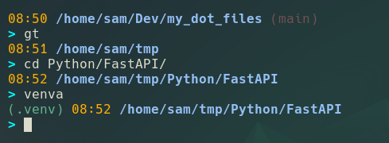
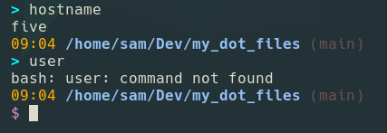
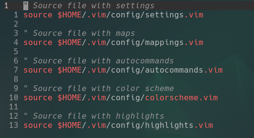
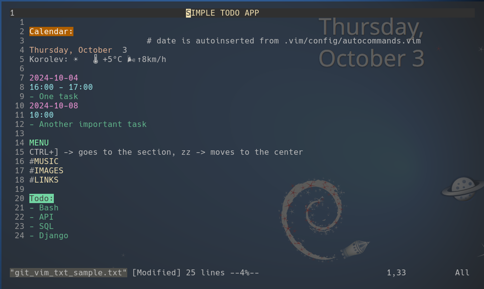

# MY DOT FILES

**Update:**

- new structure for my dot files (each group in its folder)
- switched back to bash from zsh
- new prompt structure in .bashrc

## .bashrc

- need current time -> I work in "full screen" modes
- don't need usual username@host -> I know them + hostname
- full path as several projects might have similar structure + like it
- prompt with aqua ">" & red "$" for mistakes

### how to:

- rename files "bashrc" and "bash_prompt" -> add dots
- place in your $HOME
- place "aliasrc" and "aliasrc_bash_colors" into $/HOME/.config
- change colors and aliases to your likes and needs
- Enjoy!

## .vim

***It's awesome!***

One day my .vimrc file with all its bells and whistles started to look like
something, that would need contents menu and idexes.

I challenged my son Yura to create a modular structure.

He came up with a bunch of ideas: imports, theme swapping mechanics, fast and
easy to use navigation.

In two or three days new .vim was tested and ready. He calls it Sunny Vim.

Have you ever seen .vimrc shorter?

I added a few custom highlights for \*.txt files and some minor tweaks.

And now every text file works like a colorful web page. This includes active
links to other files, page anchors, opening http-links, playing audio and video
from path.

Oh, yes the contents of such files could be auto-generated on opening!

So I enjoy updated calendar and todo task list. Wow!

